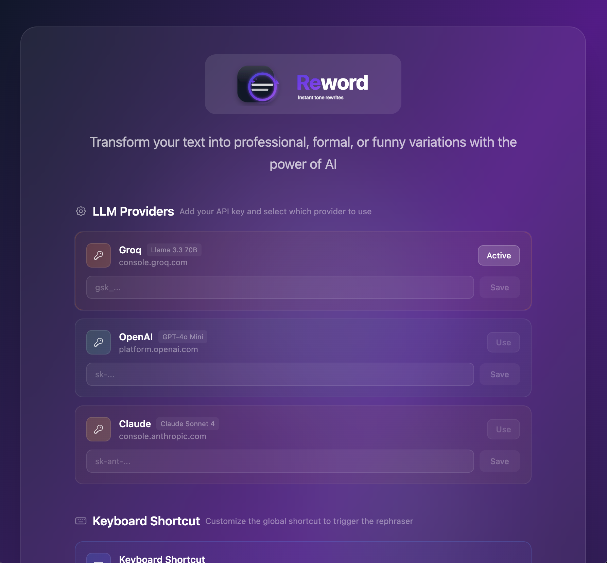
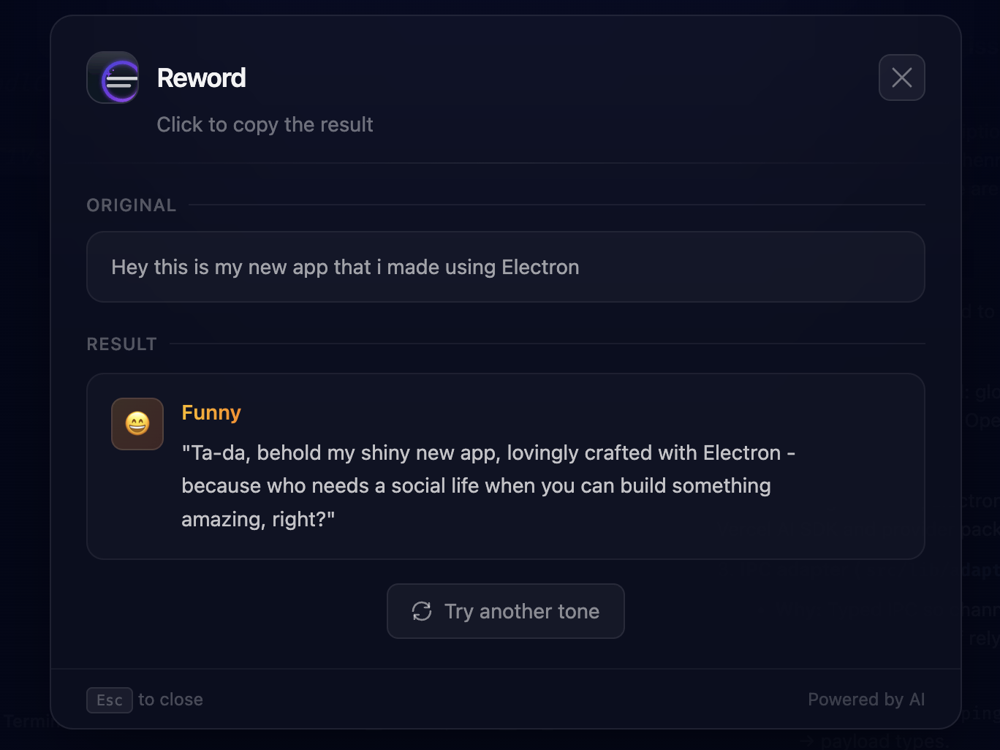

<div align="center">
  
</div>

# Reword

A desktop app that rephrases selected text in different tones using AI. Select text anywhere, trigger a global hotkey, choose a tone (e.g. professional, casual, funny), and get an AI-rewritten version to copy.

## What the app does

- **Global hotkey**: Register a shortcut (e.g. Ctrl/Cmd + Shift + R) to capture the current text selection and open the popup.
- **Selection capture**: Uses the system clipboard (simulating copy) to get the selected text on macOS, Windows, and Linux.
- **Tone rephrasing**: Pick a tone (Professional, Formal, Casual, Friendly, Funny, Persuasive, Concise) and send the text to an LLM to get a rephrased version.
- **Multiple AI providers**: Supports **Groq** (Llama), **OpenAI** (GPT-4o-mini), and **Anthropic** (Claude). API keys and the active provider are configurable in the app and stored locally (electron-store).
- **Popup UI**: A small, always-on-top window shows the original text, lets you pick a tone, shows the result, and lets you copy it.

## Screenshots

### Main Window


### Result View


## Technologies

| Area | Stack |
|------|--------|
| **Desktop** | [Electron](https://www.electronjs.org/) |
| **Build / dev** | [electron-vite](https://electron-vite.org/), [Vite](https://vitejs.dev/) |
| **UI** | [React](https://react.dev/) 19, [Tailwind CSS](https://tailwindcss.com/) 4 |
| **Language** | [TypeScript](https://www.typescriptlang.org/) |
| **AI** | [Vercel AI SDK](https://sdk.vercel.ai/) (`ai`), [@ai-sdk/groq](https://www.npmjs.com/package/@ai-sdk/groq), [@ai-sdk/openai](https://www.npmjs.com/package/@ai-sdk/openai), [@ai-sdk/anthropic](https://www.npmjs.com/package/@ai-sdk/anthropic) |
| **Storage** | [electron-store](https://github.com/sindresorhus/electron-store) (API keys, provider, hotkey) |
| **Env** | [dotenv](https://github.com/motdotla/dotenv) |
| **Validation** | [Zod](https://zod.dev/) |

## IPC adapter (`src/lib/adapters.ts`)

### Why we use it

Electron’s `ipcMain` / `ipcRenderer` APIs are untyped: channel names and payloads are plain strings and `any`, so mistakes (wrong channel, wrong payload shape) only show up at runtime. The adapter layer adds **type-safe IPC** by tying every channel to a single payload type via a shared mapping.

### How it works

1. **Shared mapping**  
   In `src/preload/index.d.ts`, `EventPayloadMapping` defines all IPC channel names and their payload types, e.g.:

   ```ts
   type EventPayloadMapping = {
     processingStarted: { originalText: string };
   };
   ```

2. **Main process helpers** (`src/lib/adapters.ts`):
   - **`ipcMainHandle<Key>(key, handler)`** – Registers a handler for `ipcMain.handle(key, …)` whose return type is `EventPayloadMapping[Key]`. (Not yet used in main; main currently uses raw `ipcMain.handle`.)
   - **`ipcWebContentSend<Key>(key, webContents, payload)`** – Sends a message to a renderer with `webContents.send(key, payload)`. The `payload` type must match `EventPayloadMapping[Key]`.
   - **`ipcMainOn<Key>(key, handler)`** – Registers `ipcMain.on(key, …)` with a handler that receives `EventPayloadMapping[Key]`.

3. **Usage**  
   When the main process has the selected text and the popup is ready, it notifies the renderer with the correct payload type:

   ```ts
   // src/lib/getCopyText.ts
   ipcWebContentSend('processingStarted', mainWindow.webContents, {
     originalText: text
   });
   ```

   The preload exposes `subscribeToProcessingStarted`, which listens on the same channel and forwards the typed payload to the renderer. Adding a new channel means: (1) extending `EventPayloadMapping`, (2) using one of the adapter functions with that key, and (3) exposing it in the preload. TypeScript then enforces channel names and payload shapes across main, preload, and renderer.

## Recommended IDE Setup

- [VSCode](https://code.visualstudio.com/) + [ESLint](https://marketplace.visualstudio.com/items?itemName=dbaeumer.vscode-eslint) + [Prettier](https://marketplace.visualstudio.com/items?itemName=esbenp.prettier-vscode)

## Project Setup

### Install

```bash
$ npm install
```

### Development

```bash
$ npm run dev
```

### Build

```bash
# For windows
$ npm run build:win

# For macOS
$ npm run build:mac

# For Linux
$ npm run build:linux
```
